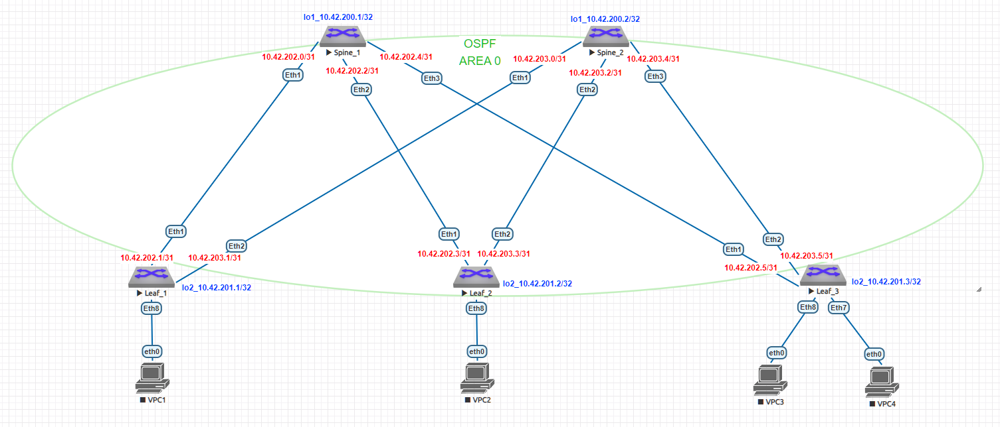

# Домашнее задание №2
## Underlay. OSPF
### Цель:
- Настроить OSPF для Underlay сети
- Проверить связанность между устройствами
### Выполнение:
#### Собранная схема сети


#### Конфигурация оборудования

- [Leaf-1](config/Leaf-1.conf)

```
router ospf 1
   router-id 10.42.201.1
   bfd default
   passive-interface default
   no passive-interface Ethernet1
   no passive-interface Ethernet2
   max-lsa 12000

interface Ethernet1
   no switchport
   ip address 10.42.202.1/31
   bfd interval 200 min-rx 200 multiplier 3
   ip ospf neighbor bfd
   ip ospf network point-to-point
   ip ospf authentication
   ip ospf area 0.0.0.0
   ip ospf message-digest-key 255 sha256 7 ER7IpygHYKruJOymRCZSa9ZZGn9YGZjS

interface Ethernet2
   no switchport
   ip address 10.42.203.1/31
   bfd interval 200 min-rx 200 multiplier 3
   ip ospf neighbor bfd
   ip ospf network point-to-point
   ip ospf authentication
   ip ospf area 0.0.0.0
   ip ospf message-digest-key 255 sha256 7 4Ex0GQ42dgN1Vb6Z+4DlxlEdPxjN2gLJ

interface Loopback2
   ip address 10.42.201.1/32
   ip ospf area 0.0.0.0
```

- [Leaf-2](config/Leaf-2.conf)

```
router ospf 1
   router-id 10.42.201.2
   bfd default
   passive-interface default
   no passive-interface Ethernet1
   no passive-interface Ethernet2
   max-lsa 12000

interface Ethernet1
   no switchport
   ip address 10.42.202.3/31
   bfd interval 200 min-rx 200 multiplier 3
   ip ospf neighbor bfd
   ip ospf network point-to-point
   ip ospf authentication
   ip ospf area 0.0.0.0
   ip ospf message-digest-key 255 sha256 7 ER7IpygHYKruJOymRCZSa9ZZGn9YGZjS

interface Ethernet2
   no switchport
   ip address 10.42.203.3/31
   bfd interval 200 min-rx 200 multiplier 3
   ip ospf neighbor bfd
   ip ospf network point-to-point
   ip ospf authentication
   ip ospf area 0.0.0.0
   ip ospf message-digest-key 255 sha256 7 4Ex0GQ42dgN1Vb6Z+4DlxlEdPxjN2gLJ

interface Loopback2
   ip address 10.42.201.2/32
   ip ospf area 0.0.0.0
```

- [Leaf-3](config/Leaf-3.conf)

```
router ospf 1
   router-id 10.42.201.3
   bfd default
   passive-interface default
   no passive-interface Ethernet1
   no passive-interface Ethernet2
   max-lsa 12000

interface Ethernet1
   no switchport
   ip address 10.42.202.5/31
   bfd interval 200 min-rx 200 multiplier 3
   ip ospf neighbor bfd
   ip ospf network point-to-point
   ip ospf authentication
   ip ospf area 0.0.0.0
   ip ospf message-digest-key 255 sha256 7 ER7IpygHYKruJOymRCZSa9ZZGn9YGZjS

interface Ethernet2
   no switchport
   ip address 10.42.203.5/31
   bfd interval 200 min-rx 200 multiplier 3
   ip ospf neighbor bfd
   ip ospf network point-to-point
   ip ospf authentication
   ip ospf area 0.0.0.0
   ip ospf message-digest-key 255 sha256 7 4Ex0GQ42dgN1Vb6Z+4DlxlEdPxjN2gLJ

interface Loopback2
   ip address 10.42.201.3/32
   ip ospf area 0.0.0.0
```

- [Spine-1](config/Spine-1.conf)

```
router ospf 1
   router-id 10.42.200.1
   bfd default
   passive-interface default
   no passive-interface Ethernet1
   no passive-interface Ethernet2
   no passive-interface Ethernet3
   passive-interface Loopback1
   max-lsa 12000

interface Ethernet1
   no switchport
   ip address 10.42.202.0/31
   bfd interval 200 min-rx 200 multiplier 3
   ip ospf neighbor bfd
   ip ospf network point-to-point
   ip ospf authentication
   ip ospf area 0.0.0.0
   ip ospf message-digest-key 255 sha256 7 ER7IpygHYKruJOymRCZSa9ZZGn9YGZjS

interface Ethernet2
   no switchport
   ip address 10.42.202.2/31
   bfd interval 200 min-rx 200 multiplier 3
   ip ospf neighbor bfd
   ip ospf network point-to-point
   ip ospf authentication
   ip ospf area 0.0.0.0
   ip ospf message-digest-key 255 sha256 7 4Ex0GQ42dgN1Vb6Z+4DlxlEdPxjN2gLJ

interface Ethernet3
   no switchport
   ip address 10.42.202.4/31
   bfd interval 200 min-rx 200 multiplier 3
   ip ospf neighbor bfd
   ip ospf network point-to-point
   ip ospf authentication
   ip ospf area 0.0.0.0
   ip ospf message-digest-key 255 sha256 7 4Ex0GQ42dgN1Vb6Z+4DlxlEdPxjN2gLJ

interface Loopback1
   ip address 10.42.200.1/32
   ip ospf area 0.0.0.0
```

- [Spine-2](config/Spine-2.conf)

```
router ospf 1
   router-id 10.42.200.2
   bfd default
   passive-interface default
   no passive-interface Ethernet1
   no passive-interface Ethernet2
   no passive-interface Ethernet3
   max-lsa 12000

interface Ethernet1
   no switchport
   ip address 10.42.203.0/31
   bfd interval 200 min-rx 200 multiplier 3
   ip ospf neighbor bfd
   ip ospf network point-to-point
   ip ospf authentication
   ip ospf area 0.0.0.0
   ip ospf message-digest-key 255 sha256 7 ER7IpygHYKruJOymRCZSa9ZZGn9YGZjS

interface Ethernet2
   no switchport
   ip address 10.42.203.2/31
   bfd interval 200 min-rx 200 multiplier 3
   ip ospf neighbor bfd
   ip ospf network point-to-point
   ip ospf authentication
   ip ospf area 0.0.0.0
   ip ospf message-digest-key 255 sha256 7 4Ex0GQ42dgN1Vb6Z+4DlxlEdPxjN2gLJ

interface Ethernet3
   no switchport
   ip address 10.42.203.4/31
   bfd interval 200 min-rx 200 multiplier 3
   ip ospf neighbor bfd
   ip ospf network point-to-point
   ip ospf authentication
   ip ospf area 0.0.0.0
   ip ospf message-digest-key 255 sha256 7 4Ex0GQ42dgN1Vb6Z+4DlxlEdPxjN2gLJ

interface Loopback1
   ip address 10.42.200.2/32
   ip ospf area 0.0.0.0
```
---
#### Проверка соседства и доступности Loopback интерфейсов

- Spine-1

```
Spine-1#sh ip ospf neighbor
Neighbor ID     Instance VRF      Pri State                  Dead Time   Address         Interface
10.42.201.1     1        default  0   FULL                   00:00:34    10.42.202.1     Ethernet1
10.42.201.3     1        default  0   FULL                   00:00:29    10.42.202.5     Ethernet3
10.42.201.2     1        default  0   FULL                   00:00:29    10.42.202.3     Ethernet2

Spine-1#ping 10.42.201.1
PING 10.42.201.1 (10.42.201.1) 72(100) bytes of data.
80 bytes from 10.42.201.1: icmp_seq=1 ttl=64 time=7.53 ms
80 bytes from 10.42.201.1: icmp_seq=2 ttl=64 time=3.84 ms
80 bytes from 10.42.201.1: icmp_seq=3 ttl=64 time=3.75 ms
80 bytes from 10.42.201.1: icmp_seq=4 ttl=64 time=3.38 ms
80 bytes from 10.42.201.1: icmp_seq=5 ttl=64 time=4.19 ms

--- 10.42.201.1 ping statistics ---
5 packets transmitted, 5 received, 0% packet loss, time 31ms
rtt min/avg/max/mdev = 3.387/4.542/7.532/1.518 ms, ipg/ewma 7.820/5.991 ms

Spine-1#ping 10.42.201.2
PING 10.42.201.2 (10.42.201.2) 72(100) bytes of data.
80 bytes from 10.42.201.2: icmp_seq=1 ttl=64 time=7.32 ms
80 bytes from 10.42.201.2: icmp_seq=2 ttl=64 time=21.2 ms
80 bytes from 10.42.201.2: icmp_seq=3 ttl=64 time=5.11 ms
80 bytes from 10.42.201.2: icmp_seq=4 ttl=64 time=5.18 ms
80 bytes from 10.42.201.2: icmp_seq=5 ttl=64 time=6.45 ms

--- 10.42.201.2 ping statistics ---
5 packets transmitted, 5 received, 0% packet loss, time 42ms
rtt min/avg/max/mdev = 5.116/9.060/21.211/6.131 ms, pipe 2, ipg/ewma 10.673/7.935 ms

Spine-1#ping 10.42.201.3
PING 10.42.201.3 (10.42.201.3) 72(100) bytes of data.
80 bytes from 10.42.201.3: icmp_seq=1 ttl=64 time=7.30 ms
80 bytes from 10.42.201.3: icmp_seq=2 ttl=64 time=5.09 ms
80 bytes from 10.42.201.3: icmp_seq=3 ttl=64 time=3.86 ms
80 bytes from 10.42.201.3: icmp_seq=4 ttl=64 time=6.26 ms
80 bytes from 10.42.201.3: icmp_seq=5 ttl=64 time=5.34 ms

--- 10.42.201.3 ping statistics ---
5 packets transmitted, 5 received, 0% packet loss, time 31ms
rtt min/avg/max/mdev = 3.867/5.574/7.301/1.155 ms, ipg/ewma 7.923/6.430 ms
```

- Spine-2

```
Spine-2#sh ip ospf neighbor
Neighbor ID     Instance VRF      Pri State                  Dead Time   Address         Interface
10.42.201.1     1        default  0   FULL                   00:00:35    10.42.203.1     Ethernet1
10.42.201.3     1        default  0   FULL                   00:00:38    10.42.203.5     Ethernet3
10.42.201.2     1        default  0   FULL                   00:00:34    10.42.203.3     Ethernet2

Spine-2#ping 10.42.201.1
PING 10.42.201.1 (10.42.201.1) 72(100) bytes of data.
80 bytes from 10.42.201.1: icmp_seq=1 ttl=64 time=4.92 ms
80 bytes from 10.42.201.1: icmp_seq=2 ttl=64 time=3.67 ms
80 bytes from 10.42.201.1: icmp_seq=3 ttl=64 time=3.80 ms
80 bytes from 10.42.201.1: icmp_seq=4 ttl=64 time=3.92 ms
80 bytes from 10.42.201.1: icmp_seq=5 ttl=64 time=4.33 ms

--- 10.42.201.1 ping statistics ---
5 packets transmitted, 5 received, 0% packet loss, time 24ms
rtt min/avg/max/mdev = 3.677/4.134/4.924/0.451 ms, ipg/ewma 6.098/4.530 ms

Spine-2#ping 10.42.201.2
PING 10.42.201.2 (10.42.201.2) 72(100) bytes of data.
80 bytes from 10.42.201.2: icmp_seq=1 ttl=64 time=5.23 ms
80 bytes from 10.42.201.2: icmp_seq=2 ttl=64 time=4.98 ms
80 bytes from 10.42.201.2: icmp_seq=3 ttl=64 time=4.50 ms
80 bytes from 10.42.201.2: icmp_seq=4 ttl=64 time=4.18 ms
80 bytes from 10.42.201.2: icmp_seq=5 ttl=64 time=6.59 ms

--- 10.42.201.2 ping statistics ---
5 packets transmitted, 5 received, 0% packet loss, time 26ms
rtt min/avg/max/mdev = 4.185/5.101/6.591/0.832 ms, ipg/ewma 6.700/5.200 ms

Spine-2#ping 10.42.201.3
PING 10.42.201.3 (10.42.201.3) 72(100) bytes of data.
80 bytes from 10.42.201.3: icmp_seq=1 ttl=64 time=3.68 ms
80 bytes from 10.42.201.3: icmp_seq=2 ttl=64 time=4.13 ms
80 bytes from 10.42.201.3: icmp_seq=3 ttl=64 time=3.51 ms
80 bytes from 10.42.201.3: icmp_seq=4 ttl=64 time=4.07 ms
80 bytes from 10.42.201.3: icmp_seq=5 ttl=64 time=3.67 ms

--- 10.42.201.3 ping statistics ---
5 packets transmitted, 5 received, 0% packet loss, time 23ms
rtt min/avg/max/mdev = 3.519/3.815/4.138/0.255 ms, ipg/ewma 5.773/3.745 ms
```

#### Проверка bfd

- Spine-1

```
Spine-1#sh bfd peers
VRF name: default
-----------------
DstAddr         MyDisc   YourDisc  Interface/Transport    Type          LastUp
----------- ---------- ----------- -------------------- ------- ---------------
10.42.202.1 1027869874  237362213        Ethernet1(14)  normal  05/20/24 05:57
10.42.202.3  952561578 2507484800        Ethernet2(15)  normal  05/20/24 06:01
10.42.202.5  239590224 3020846445        Ethernet3(16)  normal  05/20/24 06:01

   LastDown            LastDiag    State
-------------- ------------------- -----
         NA       No Diagnostic       Up
         NA       No Diagnostic       Up
         NA       No Diagnostic       Up
```

- Spine-2

```
Spine-2#sh bfd peers
VRF name: default
-----------------
DstAddr         MyDisc   YourDisc  Interface/Transport    Type          LastUp
----------- ---------- ----------- -------------------- ------- ---------------
10.42.203.1   71101736  232391118        Ethernet1(14)  normal  05/20/24 05:59
10.42.203.3 2245053632  849236790        Ethernet2(15)  normal  05/20/24 06:01
10.42.203.5  488018650 3284696372        Ethernet3(16)  normal  05/20/24 06:01

   LastDown            LastDiag    State
-------------- ------------------- -----
         NA       No Diagnostic       Up
         NA       No Diagnostic       Up
         NA       No Diagnostic       Up
```
