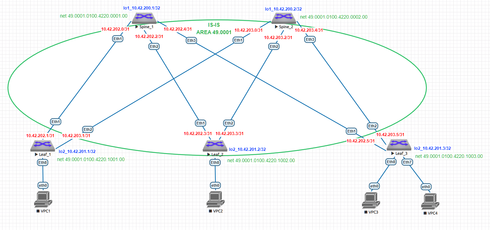

# Домашнее задание №3
## Underlay. ISIS
### Цель:
- Настроить ISIS для Underlay сети
- Проверить связанность между устройствами
### Выполнение:
#### Собранная схема сети


#### Конфигурация оборудования

- [Leaf-1](config/Leaf-1.conf)

```
router isis Underlay
   net 49.0001.0100.4220.1001.00
   is-type level-1
   !
   address-family ipv4 unicast
      bfd all-interfaces

interface Ethernet1
   no switchport
   ip address 10.42.202.1/31
   bfd interval 100 min-rx 100 multiplier 3
   isis enable Underlay
   isis bfd
   isis network point-to-point
   isis authentication mode md5
   isis authentication key 7 mOPGThZ/JTjVvxs3x+ovpg==

interface Ethernet2
   no switchport
   ip address 10.42.203.1/31
   bfd interval 100 min-rx 100 multiplier 3
   isis enable Underlay
   isis bfd
   isis network point-to-point
   isis authentication mode md5
   isis authentication key 7 mOPGThZ/JTjVvxs3x+ovpg==

interface Loopback2
   ip address 10.42.201.1/32
   isis enable Underlay
```

- [Leaf-2](config/Leaf-2.conf)

```
router isis Underlay
   net 49.0001.0100.4220.1002.00
   is-type level-1
   !
   address-family ipv4 unicast
      bfd all-interfaces

interface Ethernet1
   no switchport
   ip address 10.42.202.3/31
   bfd interval 100 min-rx 100 multiplier 3
   isis enable Underlay
   isis bfd
   isis network point-to-point
   isis authentication mode md5
   isis authentication key 7 mOPGThZ/JTjVvxs3x+ovpg==

interface Ethernet2
   no switchport
   ip address 10.42.203.3/31
   bfd interval 100 min-rx 100 multiplier 3
   isis enable Underlay
   isis bfd
   isis network point-to-point
   isis authentication mode md5
   isis authentication key 7 mOPGThZ/JTjVvxs3x+ovpg==

interface Loopback2
   ip address 10.42.201.2/32
   isis enable Underlay
```

- [Leaf-3](config/Leaf-3.conf)

```
router isis Underlay
   net 49.0001.0100.4220.1003.00
   is-type level-1
   !
   address-family ipv4 unicast
      bfd all-interfaces

interface Ethernet1
   no switchport
   ip address 10.42.202.5/31
   bfd interval 100 min-rx 100 multiplier 3
   isis enable Underlay
   isis bfd
   isis network point-to-point
   isis authentication mode md5
   isis authentication key 7 mOPGThZ/JTjVvxs3x+ovpg==

interface Ethernet2
   no switchport
   ip address 10.42.203.5/31
   bfd interval 100 min-rx 100 multiplier 3
   isis enable Underlay
   isis bfd
   isis network point-to-point
   isis authentication mode md5
   isis authentication key 7 mOPGThZ/JTjVvxs3x+ovpg==

interface Loopback2
   ip address 10.42.201.3/32
   isis enable Underlay
```

- [Spine-1](config/Spine-1.conf)

```
router isis Underlay
   net 49.0001.0100.4220.0001.00
   is-type level-1
   !
   address-family ipv4 unicast
      bfd all-interfaces

interface Ethernet1
   no switchport
   ip address 10.42.202.0/31
   bfd interval 100 min-rx 100 multiplier 3
   isis enable Underlay
   isis bfd
   isis network point-to-point
   isis authentication mode md5
   isis authentication key 7 mOPGThZ/JTjVvxs3x+ovpg==

interface Ethernet2
   no switchport
   ip address 10.42.202.2/31
   bfd interval 100 min-rx 100 multiplier 3
   isis enable Underlay
   isis bfd
   isis network point-to-point
   isis authentication mode md5
   isis authentication key 7 mOPGThZ/JTjVvxs3x+ovpg==

interface Ethernet3
   no switchport
   ip address 10.42.202.4/31
   bfd interval 100 min-rx 100 multiplier 3
   isis enable Underlay
   isis bfd
   isis network point-to-point
   isis authentication mode md5
   isis authentication key 7 mOPGThZ/JTjVvxs3x+ovpg==

interface Loopback1
   ip address 10.42.200.1/32
   isis enable Underlay
```

- [Spine-2](config/Spine-2.conf)

```
router isis Underlay
   net 49.0001.0100.4220.0002.00
   is-type level-1
   !
   address-family ipv4 unicast
      bfd all-interfaces

interface Ethernet1
   no switchport
   ip address 10.42.203.0/31
   bfd interval 100 min-rx 100 multiplier 3
   isis enable Underlay
   isis bfd
   isis network point-to-point
   isis authentication mode md5
   isis authentication key 7 mOPGThZ/JTjVvxs3x+ovpg==

interface Ethernet2
   no switchport
   ip address 10.42.203.2/31
   bfd interval 100 min-rx 100 multiplier 3
   isis enable Underlay
   isis bfd
   isis network point-to-point
   isis authentication mode md5
   isis authentication key 7 mOPGThZ/JTjVvxs3x+ovpg==

interface Ethernet3
   no switchport
   ip address 10.42.203.4/31
   bfd interval 100 min-rx 100 multiplier 3
   isis enable Underlay
   isis bfd
   isis network point-to-point
   isis authentication mode md5
   isis authentication key 7 mOPGThZ/JTjVvxs3x+ovpg==

interface Loopback1
   ip address 10.42.200.2/32
   isis enable Underlay
```
---
#### Проверка соседства и таблицы маршрутизации

- Spine-1

```
Spine-1#sh isis int br

IS-IS Instance: Underlay VRF: default

Interface Level IPv4 Metric IPv6 Metric Type           Adjacency
--------- ----- ----------- ----------- -------------- ---------
Ethernet1 L1             10          10 point-to-point         1
Ethernet2 L1             10          10 point-to-point         1
Ethernet3 L1             10          10 point-to-point         1
Loopback1 L1             10          10 loopback       (passive)

Spine-1#sh isis neighbors

Instance  VRF      System Id        Type Interface          SNPA              State Hold time   Circuit Id
Underlay  default  Leaf-1           L1   Ethernet1          P2P               UP    21          0D
Underlay  default  Leaf-2           L1   Ethernet2          P2P               UP    23          0D
Underlay  default  Leaf-3           L1   Ethernet3          P2P               UP    22          0D

Spine-1#sh isis database

IS-IS Instance: Underlay VRF: default
  IS-IS Level 1 Link State Database
    LSPID                   Seq Num  Cksum  Life Length IS Flags
    Spine-1.00-00                54  51290   965    147 L1 <>
    Spine-2.00-00                67   9191   580    147 L1 <>
    Leaf-1.00-00                 49  22573  1025    122 L1 <>
    Leaf-2.00-00                 45  30724  1131    122 L1 <>
    Leaf-3.00-00                 48  35553   965    122 L1 <>

Spine-1#sh ip route

VRF: default
Codes: C - connected, S - static, K - kernel,
       O - OSPF, IA - OSPF inter area, E1 - OSPF external type 1,
       E2 - OSPF external type 2, N1 - OSPF NSSA external type 1,
       N2 - OSPF NSSA external type2, B - Other BGP Routes,
       B I - iBGP, B E - eBGP, R - RIP, I L1 - IS-IS level 1,
       I L2 - IS-IS level 2, O3 - OSPFv3, A B - BGP Aggregate,
       A O - OSPF Summary, NG - Nexthop Group Static Route,
       V - VXLAN Control Service, M - Martian,
       DH - DHCP client installed default route,
       DP - Dynamic Policy Route, L - VRF Leaked,
       G  - gRIBI, RC - Route Cache Route

Gateway of last resort is not set

 C        10.42.200.1/32 is directly connected, Loopback1
 I L1     10.42.200.2/32 [115/30] via 10.42.202.1, Ethernet1
                                  via 10.42.202.3, Ethernet2
                                  via 10.42.202.5, Ethernet3
 I L1     10.42.201.1/32 [115/20] via 10.42.202.1, Ethernet1
 I L1     10.42.201.2/32 [115/20] via 10.42.202.3, Ethernet2
 I L1     10.42.201.3/32 [115/20] via 10.42.202.5, Ethernet3
 C        10.42.202.0/31 is directly connected, Ethernet1
 C        10.42.202.2/31 is directly connected, Ethernet2
 C        10.42.202.4/31 is directly connected, Ethernet3
 I L1     10.42.203.0/31 [115/20] via 10.42.202.1, Ethernet1
 I L1     10.42.203.2/31 [115/20] via 10.42.202.3, Ethernet2
 I L1     10.42.203.4/31 [115/20] via 10.42.202.5, Ethernet3

Spine-1#ping 10.42.200.2 repeat 1
PING 10.42.200.2 (10.42.200.2) 72(100) bytes of data.
80 bytes from 10.42.200.2: icmp_seq=1 ttl=63 time=11.1 ms

--- 10.42.200.2 ping statistics ---
1 packets transmitted, 1 received, 0% packet loss, time 0ms
rtt min/avg/max/mdev = 11.146/11.146/11.146/0.000 ms
Spine-1#
Spine-1#ping 10.42.201.1 repeat 1
PING 10.42.201.1 (10.42.201.1) 72(100) bytes of data.
80 bytes from 10.42.201.1: icmp_seq=1 ttl=64 time=4.85 ms

--- 10.42.201.1 ping statistics ---
1 packets transmitted, 1 received, 0% packet loss, time 0ms
rtt min/avg/max/mdev = 4.858/4.858/4.858/0.000 ms
Spine-1#
Spine-1#ping 10.42.201.2 repeat 1
PING 10.42.201.2 (10.42.201.2) 72(100) bytes of data.
80 bytes from 10.42.201.2: icmp_seq=1 ttl=64 time=53.2 ms

--- 10.42.201.2 ping statistics ---
1 packets transmitted, 1 received, 0% packet loss, time 0ms
rtt min/avg/max/mdev = 53.262/53.262/53.262/0.000 ms
Spine-1#
Spine-1#ping 10.42.201.3 repeat 1
PING 10.42.201.3 (10.42.201.3) 72(100) bytes of data.
80 bytes from 10.42.201.3: icmp_seq=1 ttl=64 time=5.48 ms

--- 10.42.201.3 ping statistics ---
1 packets transmitted, 1 received, 0% packet loss, time 0ms
rtt min/avg/max/mdev = 5.488/5.488/5.488/0.000 ms
```

- Spine-2

```
Spine-2#sh isis int br

IS-IS Instance: Underlay VRF: default

Interface Level IPv4 Metric IPv6 Metric Type           Adjacency
--------- ----- ----------- ----------- -------------- ---------
Ethernet1 L1             10          10 point-to-point         1
Ethernet2 L1             10          10 point-to-point         1
Ethernet3 L1             10          10 point-to-point         1
Loopback1 L1             10          10 loopback       (passive)

Spine-2#sh isis neighbors

Instance  VRF      System Id        Type Interface          SNPA              State Hold time   Circuit Id
Underlay  default  Leaf-1           L1   Ethernet1          P2P               UP    29          0E
Underlay  default  Leaf-2           L1   Ethernet2          P2P               UP    28          0E
Underlay  default  Leaf-3           L1   Ethernet3          P2P               UP    26          0E

Spine-2#sh isis database

IS-IS Instance: Underlay VRF: default
  IS-IS Level 1 Link State Database
    LSPID                   Seq Num  Cksum  Life Length IS Flags
    Spine-1.00-00                54  51290   832    147 L1 <>
    Spine-2.00-00                68   8680  1180    147 L1 <>
    Leaf-1.00-00                 49  22573   892    122 L1 <>
    Leaf-2.00-00                 45  30724   998    122 L1 <>
    Leaf-3.00-00                 48  35553   832    122 L1 <>

Spine-2#sh ip route

VRF: default
Codes: C - connected, S - static, K - kernel,
       O - OSPF, IA - OSPF inter area, E1 - OSPF external type 1,
       E2 - OSPF external type 2, N1 - OSPF NSSA external type 1,
       N2 - OSPF NSSA external type2, B - Other BGP Routes,
       B I - iBGP, B E - eBGP, R - RIP, I L1 - IS-IS level 1,
       I L2 - IS-IS level 2, O3 - OSPFv3, A B - BGP Aggregate,
       A O - OSPF Summary, NG - Nexthop Group Static Route,
       V - VXLAN Control Service, M - Martian,
       DH - DHCP client installed default route,
       DP - Dynamic Policy Route, L - VRF Leaked,
       G  - gRIBI, RC - Route Cache Route

Gateway of last resort is not set

 I L1     10.42.200.1/32 [115/30] via 10.42.203.1, Ethernet1
                                  via 10.42.203.3, Ethernet2
                                  via 10.42.203.5, Ethernet3
 C        10.42.200.2/32 is directly connected, Loopback1
 I L1     10.42.201.1/32 [115/20] via 10.42.203.1, Ethernet1
 I L1     10.42.201.2/32 [115/20] via 10.42.203.3, Ethernet2
 I L1     10.42.201.3/32 [115/20] via 10.42.203.5, Ethernet3
 I L1     10.42.202.0/31 [115/20] via 10.42.203.1, Ethernet1
 I L1     10.42.202.2/31 [115/20] via 10.42.203.3, Ethernet2
 I L1     10.42.202.4/31 [115/20] via 10.42.203.5, Ethernet3
 C        10.42.203.0/31 is directly connected, Ethernet1
 C        10.42.203.2/31 is directly connected, Ethernet2
 C        10.42.203.4/31 is directly connected, Ethernet3

Spine-2#ping 10.42.200.1 repeat 1
PING 10.42.200.1 (10.42.200.1) 72(100) bytes of data.
80 bytes from 10.42.200.1: icmp_seq=1 ttl=63 time=12.1 ms

--- 10.42.200.1 ping statistics ---
1 packets transmitted, 1 received, 0% packet loss, time 0ms
rtt min/avg/max/mdev = 12.137/12.137/12.137/0.000 ms
Spine-2#
Spine-2#ping 10.42.201.1 repeat 1
PING 10.42.201.1 (10.42.201.1) 72(100) bytes of data.
80 bytes from 10.42.201.1: icmp_seq=1 ttl=64 time=4.70 ms

--- 10.42.201.1 ping statistics ---
1 packets transmitted, 1 received, 0% packet loss, time 0ms
rtt min/avg/max/mdev = 4.708/4.708/4.708/0.000 ms
Spine-2#
Spine-2#ping 10.42.201.2 repeat 1
PING 10.42.201.2 (10.42.201.2) 72(100) bytes of data.
80 bytes from 10.42.201.2: icmp_seq=1 ttl=64 time=5.36 ms

--- 10.42.201.2 ping statistics ---
1 packets transmitted, 1 received, 0% packet loss, time 0ms
rtt min/avg/max/mdev = 5.369/5.369/5.369/0.000 ms
Spine-2#
Spine-2#ping 10.42.201.3 repeat 1
PING 10.42.201.3 (10.42.201.3) 72(100) bytes of data.
80 bytes from 10.42.201.3: icmp_seq=1 ttl=64 time=6.00 ms

--- 10.42.201.3 ping statistics ---
1 packets transmitted, 1 received, 0% packet loss, time 0ms
rtt min/avg/max/mdev = 6.007/6.007/6.007/0.000 ms
```

#### Проверка bfd

- Spine-1

```
Spine-1#sh bfd peers
VRF name: default
-----------------
DstAddr         MyDisc   YourDisc  Interface/Transport    Type          LastUp
----------- ---------- ----------- -------------------- ------- ---------------
10.42.202.1 2330181224 1173837702        Ethernet1(13)  normal  05/23/24 19:22
10.42.202.3 1853273567 3980475551        Ethernet2(14)  normal  05/23/24 19:22
10.42.202.5 1096071456 1179503145        Ethernet3(15)  normal  05/23/24 19:22

   LastDown            LastDiag    State
-------------- ------------------- -----
         NA       No Diagnostic       Up
         NA       No Diagnostic       Up
         NA       No Diagnostic       Up
```

- Spine-2

```
Spine-2#sh bfd peers
VRF name: default
-----------------
DstAddr         MyDisc   YourDisc  Interface/Transport    Type          LastUp
----------- ---------- ----------- -------------------- ------- ---------------
10.42.203.1  190539380 3816975835        Ethernet1(13)  normal  05/23/24 19:15
10.42.203.3 1451628998 1793815310        Ethernet2(14)  normal  05/23/24 19:15
10.42.203.5 1927091226 4185012628        Ethernet3(15)  normal  05/23/24 19:15

   LastDown            LastDiag    State
-------------- ------------------- -----
         NA       No Diagnostic       Up
         NA       No Diagnostic       Up
         NA       No Diagnostic       Up
```

