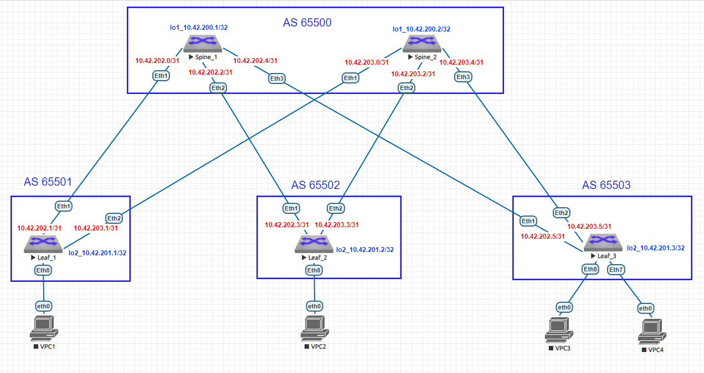

# Домашнее задание №4
## Underlay. eBGP
### Цель:
- Настроить eBGP для Underlay сети
- Проверить связанность между устройствами
### Выполнение:
#### Собранная схема сети


#### Конфигурация оборудования

- [Leaf-1](config/Leaf-1.conf)

```

```

- [Leaf-2](config/Leaf-2.conf)

```

```

- [Leaf-3](config/Leaf-3.conf)

```

```

- [Spine-1](config/Spine-1.conf)

```

```

- [Spine-2](config/Spine-2.conf)

```

```
---
#### Проверка связности 

- Spine-1

```

```

- Spine-2

```

```

- Leaf-1

```

```

- Leaf-2

```

```

- Leaf-3

```

```

#### Проверка bfd

- Spine-1

```

```

- Spine-2

```

```

- Leaf-1

```

```

- Leaf-2

```

```

- Leaf-3

```

```
