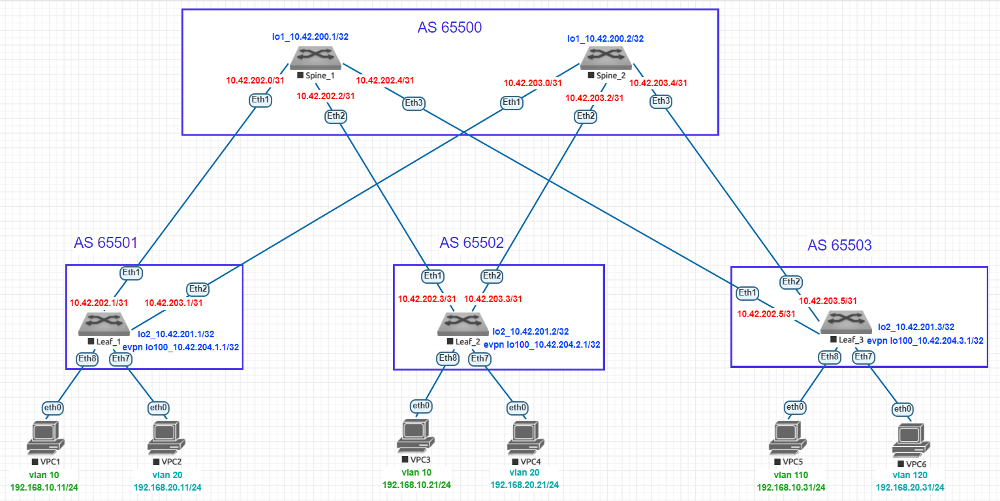

# Домашнее задание №5
## Overlay. VxLAN EVPN L2
### Цель:
- Настроить Overlay на основе VxLAN EVPN для L2 связанности между клиентами
- Проверить связанность между устройствами
### Выполнение:
#### Собранная схема сети


#### Конфигурация оборудования

- [Leaf-1](config/Leaf-1.conf)

```
service routing protocols model multi-agent
!
vlan 10,20
!
interface Ethernet7
   switchport access vlan 20
!
interface Ethernet8
   switchport access vlan 10
!
interface Loopback100
   ip address 10.42.204.1/32
!
interface Vxlan1
   vxlan source-interface Loopback100
   vxlan udp-port 4789
   vxlan vlan 10 vni 100010
   vxlan vlan 20 vni 100020
   vxlan learn-restrict any
!
router bgp 65501
   router-id 10.42.201.1
   timers bgp 3 9
   distance bgp 20 200 200
   maximum-paths 12
   neighbor evpn peer group
   neighbor evpn remote-as 65500
   neighbor evpn update-source Loopback2
   neighbor evpn ebgp-multihop 3
   neighbor evpn send-community extended
   neighbor evpn maximum-routes 12000 warning-only
   neighbor spines peer group
   neighbor spines remote-as 65500
   neighbor spines maximum-routes 12000 warning-only
   neighbor 10.42.200.1 peer group evpn
   neighbor 10.42.200.2 peer group evpn
   neighbor 10.42.202.0 peer group spines
   neighbor 10.42.202.0 bfd
   neighbor 10.42.202.0 password 7 ibb0kmOVqswUe/kiMbQcQg==
   neighbor 10.42.203.0 peer group spines
   neighbor 10.42.203.0 bfd
   neighbor 10.42.203.0 password 7 ibb0kmOVqswUe/kiMbQcQg==
   !
   vlan 10
      rd 65501:100010
      route-target both 10:100010
      redistribute learned
   !
   vlan 20
      rd 65501:100020
      route-target both 20:100020
      redistribute learned
   !
   address-family evpn
      neighbor evpn activate
   !
   address-family ipv4
      no neighbor evpn activate
      neighbor spines activate
      network 10.42.201.1/32
      network 10.42.204.1/32
```

- [Leaf-2](config/Leaf-2.conf)

```
service routing protocols model multi-agent
!
vlan 10,20
!
interface Ethernet7
   switchport access vlan 20
!
interface Ethernet8
   switchport access vlan 10
!
interface Loopback100
   ip address 10.42.204.2/32
!
interface Vxlan1
   vxlan source-interface Loopback100
   vxlan udp-port 4789
   vxlan vlan 10 vni 100010
   vxlan vlan 20 vni 100020
   vxlan learn-restrict any
!
router bgp 65502
   router-id 10.42.201.2
   timers bgp 3 9
   distance bgp 20 200 200
   maximum-paths 12
   neighbor evpn peer group
   neighbor evpn remote-as 65500
   neighbor evpn update-source Loopback2
   neighbor evpn ebgp-multihop 3
   neighbor evpn send-community extended
   neighbor evpn maximum-routes 12000 warning-only
   neighbor spines peer group
   neighbor spines remote-as 65500
   neighbor spines maximum-routes 12000 warning-only
   neighbor 10.42.200.1 peer group evpn
   neighbor 10.42.200.2 peer group evpn
   neighbor 10.42.202.2 peer group spines
   neighbor 10.42.202.2 bfd
   neighbor 10.42.202.2 password 7 2anhXaro2sOjrW/UwD+rrg==
   neighbor 10.42.203.2 peer group spines
   neighbor 10.42.203.2 bfd
   neighbor 10.42.203.2 password 7 2anhXaro2sOjrW/UwD+rrg==
   !
   vlan 10
      rd 65502:100010
      route-target both 10:100010
      redistribute learned
   !
   vlan 20
      rd 65502:100020
      route-target both 20:100020
      redistribute learned
   !
   address-family evpn
      neighbor evpn activate
   !
   address-family ipv4
      no neighbor evpn activate
      neighbor spines activate
      network 10.42.201.2/32
      network 10.42.204.2/32
```

- [Leaf-3](config/Leaf-3.conf)

```
service routing protocols model multi-agent
!
vlan 110,120
!
interface Ethernet7
   switchport access vlan 120
!
interface Ethernet8
   switchport access vlan 110
!
interface Loopback100
   ip address 10.42.204.3/32
!
interface Vxlan1
   vxlan source-interface Loopback100
   vxlan udp-port 4789
   vxlan vlan 110 vni 100010
   vxlan vlan 120 vni 100020
   vxlan learn-restrict any
!
router bgp 65503
   router-id 10.42.201.3
   timers bgp 3 9
   distance bgp 20 200 200
   maximum-paths 12
   neighbor evpn peer group
   neighbor evpn remote-as 65500
   neighbor evpn update-source Loopback2
   neighbor evpn ebgp-multihop 3
   neighbor evpn send-community extended
   neighbor evpn maximum-routes 12000 warning-only
   neighbor spines peer group
   neighbor spines remote-as 65500
   neighbor spines maximum-routes 12000 warning-only
   neighbor 10.42.200.1 peer group evpn
   neighbor 10.42.200.2 peer group evpn
   neighbor 10.42.202.4 peer group spines
   neighbor 10.42.202.4 bfd
   neighbor 10.42.202.4 password 7 UAz8iCGpVsnDNsqXDgEJtw==
   neighbor 10.42.203.4 peer group spines
   neighbor 10.42.203.4 bfd
   neighbor 10.42.203.4 password 7 UAz8iCGpVsnDNsqXDgEJtw==
   !
   vlan 110
      rd 65503:100010
      route-target both 10:100010
      redistribute learned
   !
   vlan 120
      rd 65503:100020
      route-target both 20:100020
      redistribute learned
   !
   address-family evpn
      neighbor evpn activate
   !
   address-family ipv4
      no neighbor evpn activate
      neighbor spines activate
      network 10.42.201.3/32
      network 10.42.204.3/32
```

- [Spine-1](config/Spine-1.conf)

```
service routing protocols model multi-agent
!
peer-filter leaf_as
   10 match as-range 65501-65512 result accept
!
router bgp 65500
   router-id 10.42.200.1
   timers bgp 3 9
   distance bgp 20 200 200
   maximum-paths 12
   bgp listen range 10.42.201.0/24 peer-group evpn peer-filter leaf_as
   bgp listen range 10.42.202.0/24 peer-group leafes peer-filter leaf_as
   neighbor evpn peer group
   neighbor evpn next-hop-unchanged
   neighbor evpn update-source Loopback1
   neighbor evpn ebgp-multihop 3
   neighbor evpn send-community extended
   neighbor evpn maximum-routes 12000 warning-only
   neighbor leafes peer group
   neighbor leafes bfd
   neighbor leafes password 7 1hwb917VqCw1BQE1hPI0Hg==
   !
   address-family evpn
      neighbor evpn activate
   !
   address-family ipv4
      no neighbor evpn activate
      neighbor leafes activate
      network 10.42.200.1/32
```

- [Spine-2](config/Spine-2.conf)

```
service routing protocols model multi-agent
!
peer-filter leaf_as
   10 match as-range 65501-65512 result accept
!
router bgp 65500
   router-id 10.42.200.2
   timers bgp 3 9
   distance bgp 20 200 200
   maximum-paths 12
   bgp listen range 10.42.201.0/24 peer-group evpn peer-filter leaf_as
   bgp listen range 10.42.203.0/24 peer-group leafes peer-filter leaf_as
   neighbor evpn peer group
   neighbor evpn next-hop-unchanged
   neighbor evpn update-source Loopback1
   neighbor evpn ebgp-multihop 3
   neighbor evpn send-community extended
   neighbor evpn maximum-routes 12000 warning-only
   neighbor leafes peer group
   neighbor leafes bfd
   neighbor leafes password 7 1hwb917VqCw1BQE1hPI0Hg==
   !
   address-family evpn
      neighbor evpn activate
   !
   address-family ipv4
      no neighbor evpn activate
      neighbor leafes activate
      network 10.42.200.2/32
```
---
#### Проверка связности 

- Spine-1

```
Spine-1#sh bgp evpn summary
BGP summary information for VRF default
Router identifier 10.42.200.1, local AS number 65500
Neighbor Status Codes: m - Under maintenance
  Neighbor    V AS           MsgRcvd   MsgSent  InQ OutQ  Up/Down State   PfxRcd PfxAcc
  10.42.201.1 4 65501           3774      3770    0    0 02:39:49 Estab   2      2
  10.42.201.2 4 65502           3773      3766    0    0 02:39:49 Estab   2      2
  10.42.201.3 4 65503           3775      3776    0    0 02:39:50 Estab   2      2
```

- Spine-2

```
Spine-2#sh bgp evpn summary
BGP summary information for VRF default
Router identifier 10.42.200.2, local AS number 65500
Neighbor Status Codes: m - Under maintenance
  Neighbor    V AS           MsgRcvd   MsgSent  InQ OutQ  Up/Down State   PfxRcd PfxAcc
  10.42.201.1 4 65501           3787      3794    0    0 02:40:59 Estab   2      2
  10.42.201.2 4 65502           3800      3803    0    0 02:40:59 Estab   2      2
  10.42.201.3 4 65503           3785      3804    0    0 02:41:00 Estab   2      2
```

- Leaf-1

```
Leaf-1#sh ip route
VRF: default
 B E      10.42.200.1/32 [20/0] via 10.42.202.0, Ethernet1
 B E      10.42.200.2/32 [20/0] via 10.42.203.0, Ethernet2
 C        10.42.201.1/32 is directly connected, Loopback2
 B E      10.42.201.2/32 [20/0] via 10.42.202.0, Ethernet1
                                via 10.42.203.0, Ethernet2
 B E      10.42.201.3/32 [20/0] via 10.42.202.0, Ethernet1
                                via 10.42.203.0, Ethernet2
 C        10.42.202.0/31 is directly connected, Ethernet1
 C        10.42.203.0/31 is directly connected, Ethernet2
 C        10.42.204.1/32 is directly connected, Loopback100
 B E      10.42.204.2/32 [20/0] via 10.42.202.0, Ethernet1
                                via 10.42.203.0, Ethernet2
 B E      10.42.204.3/32 [20/0] via 10.42.202.0, Ethernet1
                                via 10.42.203.0, Ethernet2

Leaf-1#sh bgp summary
BGP summary information for VRF default
Router identifier 10.42.201.1, local AS number 65501
Neighbor             AS Session State AFI/SAFI                AFI/SAFI State   NLRI Rcd   NLRI Acc
----------- ----------- ------------- ----------------------- -------------- ---------- ----------
10.42.200.1       65500 Established   L2VPN EVPN              Negotiated              4          4
10.42.200.2       65500 Established   L2VPN EVPN              Negotiated              4          4
10.42.202.0       65500 Established   IPv4 Unicast            Negotiated              5          5
10.42.203.0       65500 Established   IPv4 Unicast            Negotiated              5

Leaf-1#sh vxlan vtep
Remote VTEPS for Vxlan1:
VTEP              Tunnel Type(s)
----------------- --------------
10.42.204.2       flood
10.42.204.3       flood

Total number of remote VTEPS:  2

Leaf-1#show interface vxlan1
Vxlan1 is up, line protocol is up (connected)
  Hardware is Vxlan
  Source interface is Loopback100 and is active with 10.42.204.1
  Listening on UDP port 4789
  Replication/Flood Mode is headend with Flood List Source: EVPN
  Remote MAC learning via EVPN
  VNI mapping to VLANs
  Static VLAN to VNI mapping is
    [10, 100010]      [20, 100020]
  Note: All Dynamic VLANs used by VCS are internal VLANs.
        Use 'show vxlan vni' for details.
  Static VRF to VNI mapping is not configured
  Headend replication flood vtep list is:
    10 10.42.204.2     10.42.204.3
    20 10.42.204.2     10.42.204.3
  Shared Router MAC is 0000.0000.0000

Leaf-1#sh vxlan vni
VNI to VLAN Mapping for Vxlan1
VNI          VLAN       Source       Interface       802.1Q Tag
------------ ---------- ------------ --------------- ----------
100010       10         static       Ethernet8       untagged
                                     Vxlan1          10
100020       20         static       Ethernet7       untagged
                                     Vxlan1          20

VNI to dynamic VLAN Mapping for Vxlan1
VNI       VLAN       VRF       Source
--------- ---------- --------- ------------

Leaf-1#show vxlan address-table
          Vxlan Mac Address Table
----------------------------------------------------------------------

VLAN  Mac Address     Type      Prt  VTEP             Moves   Last Move
----  -----------     ----      ---  ----             -----   ---------
  10  0050.7966.6807  EVPN      Vx1  10.42.204.2      1       0:01:36 ago
  10  0050.7966.6808  EVPN      Vx1  10.42.204.3      1       0:01:24 ago
  20  0050.7966.6809  EVPN      Vx1  10.42.204.3      1       0:00:43 ago
  20  0050.7966.680b  EVPN      Vx1  10.42.204.2      1       0:00:52 ago
Total Remote Mac Addresses for this criterion: 4

Leaf-1#show bgp evpn route-type mac-ip
BGP routing table information for VRF default
Router identifier 10.42.201.1, local AS number 65501
Route status codes: * - valid, > - active, S - Stale, E - ECMP head, e - ECMP
                    c - Contributing to ECMP, % - Pending BGP convergence
Origin codes: i - IGP, e - EGP, ? - incomplete
AS Path Attributes: Or-ID - Originator ID, C-LST - Cluster List, LL Nexthop - Link Local Nexthop

          Network                Next Hop              Metric  LocPref Weight  Path
 * >      RD: 65501:100010 mac-ip 0050.7966.6806
                                 -                     -       -       0       i
 * >Ec    RD: 65502:100010 mac-ip 0050.7966.6807
                                 10.42.204.2           -       100     0       65500 65502 i
 *  ec    RD: 65502:100010 mac-ip 0050.7966.6807
                                 10.42.204.2           -       100     0       65500 65502 i
 * >Ec    RD: 65503:100010 mac-ip 0050.7966.6808
                                 10.42.204.3           -       100     0       65500 65503 i
 *  ec    RD: 65503:100010 mac-ip 0050.7966.6808
                                 10.42.204.3           -       100     0       65500 65503 i
 * >Ec    RD: 65503:100020 mac-ip 0050.7966.6809
                                 10.42.204.3           -       100     0       65500 65503 i
 *  ec    RD: 65503:100020 mac-ip 0050.7966.6809
                                 10.42.204.3           -       100     0       65500 65503 i
 * >      RD: 65501:100020 mac-ip 0050.7966.680a
                                 -                     -       -       0       i
 * >Ec    RD: 65502:100020 mac-ip 0050.7966.680b
                                 10.42.204.2           -       100     0       65500 65502 i
 *  ec    RD: 65502:100020 mac-ip 0050.7966.680b
                                 10.42.204.2           -       100     0       65500 65502 i
```

- Leaf-2

```
Leaf-2#sh bgp summary
BGP summary information for VRF default
Router identifier 10.42.201.2, local AS number 65502
Neighbor             AS Session State AFI/SAFI                AFI/SAFI State   NLRI Rcd   NLRI Acc
----------- ----------- ------------- ----------------------- -------------- ---------- ----------
10.42.200.1       65500 Established   L2VPN EVPN              Negotiated              8          8
10.42.200.2       65500 Established   L2VPN EVPN              Negotiated              8          8
10.42.202.2       65500 Established   IPv4 Unicast            Negotiated              5          5
10.42.203.2       65500 Established   IPv4 Unicast            Negotiated              5          5

Leaf-2#sh vxlan vtep
Remote VTEPS for Vxlan1:

VTEP              Tunnel Type(s)
----------------- --------------
10.42.204.1       flood, unicast
10.42.204.3       flood, unicast

Total number of remote VTEPS:  2

Leaf-2#show interface vxlan1
Vxlan1 is up, line protocol is up (connected)
  Hardware is Vxlan
  Source interface is Loopback100 and is active with 10.42.204.2
  Listening on UDP port 4789
  Replication/Flood Mode is headend with Flood List Source: EVPN
  Remote MAC learning via EVPN
  VNI mapping to VLANs
  Static VLAN to VNI mapping is
    [10, 100010]      [20, 100020]
  Note: All Dynamic VLANs used by VCS are internal VLANs.
        Use 'show vxlan vni' for details.
  Static VRF to VNI mapping is not configured
  Headend replication flood vtep list is:
    10 10.42.204.3     10.42.204.1
    20 10.42.204.3     10.42.204.1
  Shared Router MAC is 0000.0000.0000

Leaf-2#sh vxlan vni
VNI to VLAN Mapping for Vxlan1
VNI          VLAN       Source       Interface       802.1Q Tag
------------ ---------- ------------ --------------- ----------
100010       10         static       Ethernet8       untagged
                                     Vxlan1          10
100020       20         static       Ethernet7       untagged
                                     Vxlan1          20

VNI to dynamic VLAN Mapping for Vxlan1
VNI       VLAN       VRF       Source
--------- ---------- --------- ------------

Leaf-2#show vxlan address-table
          Vxlan Mac Address Table
----------------------------------------------------------------------

VLAN  Mac Address     Type      Prt  VTEP             Moves   Last Move
----  -----------     ----      ---  ----             -----   ---------
  10  0050.7966.6806  EVPN      Vx1  10.42.204.1      1       0:01:15 ago
  10  0050.7966.6808  EVPN      Vx1  10.42.204.3      1       0:01:07 ago
  20  0050.7966.6809  EVPN      Vx1  10.42.204.3      1       0:00:43 ago
  20  0050.7966.680a  EVPN      Vx1  10.42.204.1      1       0:00:50 ago
Total Remote Mac Addresses for this criterion: 4

Leaf-2#show bgp evpn route-type mac-ip
BGP routing table information for VRF default
Router identifier 10.42.201.2, local AS number 65502
Route status codes: * - valid, > - active, S - Stale, E - ECMP head, e - ECMP
                    c - Contributing to ECMP, % - Pending BGP convergence
Origin codes: i - IGP, e - EGP, ? - incomplete
AS Path Attributes: Or-ID - Originator ID, C-LST - Cluster List, LL Nexthop - Link Local Nexthop

          Network                Next Hop              Metric  LocPref Weight  Path
 * >Ec    RD: 65501:100010 mac-ip 0050.7966.6806
                                 10.42.204.1           -       100     0       65500 65501 i
 *  ec    RD: 65501:100010 mac-ip 0050.7966.6806
                                 10.42.204.1           -       100     0       65500 65501 i
 * >      RD: 65502:100010 mac-ip 0050.7966.6807
                                 -                     -       -       0       i
 * >Ec    RD: 65503:100010 mac-ip 0050.7966.6808
                                 10.42.204.3           -       100     0       65500 65503 i
 *  ec    RD: 65503:100010 mac-ip 0050.7966.6808
                                 10.42.204.3           -       100     0       65500 65503 i
 * >Ec    RD: 65503:100020 mac-ip 0050.7966.6809
                                 10.42.204.3           -       100     0       65500 65503 i
 *  ec    RD: 65503:100020 mac-ip 0050.7966.6809
                                 10.42.204.3           -       100     0       65500 65503 i
 * >Ec    RD: 65501:100020 mac-ip 0050.7966.680a
                                 10.42.204.1           -       100     0       65500 65501 i
 *  ec    RD: 65501:100020 mac-ip 0050.7966.680a
                                 10.42.204.1           -       100     0       65500 65501 i
 * >      RD: 65502:100020 mac-ip 0050.7966.680b
                                 -                     -       -       0       i
```

- Leaf-3

```
Leaf-3#sh ip route
 B E      10.42.200.1/32 [20/0] via 10.42.202.4, Ethernet1
 B E      10.42.200.2/32 [20/0] via 10.42.203.4, Ethernet2
 B E      10.42.201.1/32 [20/0] via 10.42.202.4, Ethernet1
                                via 10.42.203.4, Ethernet2
 B E      10.42.201.2/32 [20/0] via 10.42.202.4, Ethernet1
                                via 10.42.203.4, Ethernet2
 C        10.42.201.3/32 is directly connected, Loopback2
 C        10.42.202.4/31 is directly connected, Ethernet1
 C        10.42.203.4/31 is directly connected, Ethernet2
 B E      10.42.204.1/32 [20/0] via 10.42.202.4, Ethernet1
                                via 10.42.203.4, Ethernet2
 B E      10.42.204.2/32 [20/0] via 10.42.202.4, Ethernet1
                                via 10.42.203.4, Ethernet2
 C        10.42.204.3/32 is directly connected, Loopback100

Leaf-3#sh bgp summary
BGP summary information for VRF default
Router identifier 10.42.201.3, local AS number 65503
Neighbor             AS Session State AFI/SAFI                AFI/SAFI State   NLRI Rcd   NLRI Acc
----------- ----------- ------------- ----------------------- -------------- ---------- ----------
10.42.200.1       65500 Established   L2VPN EVPN              Negotiated              8          8
10.42.200.2       65500 Established   L2VPN EVPN              Negotiated              8          8
10.42.202.4       65500 Established   IPv4 Unicast            Negotiated              5          5
10.42.203.4       65500 Established   IPv4 Unicast            Negotiated              5          5

Leaf-3#sh vxlan vtep
Remote VTEPS for Vxlan1:

VTEP              Tunnel Type(s)
----------------- --------------
10.42.204.1       flood, unicast
10.42.204.2       flood, unicast

Total number of remote VTEPS:  2

Leaf-3#show interface vxlan1
Vxlan1 is up, line protocol is up (connected)
  Hardware is Vxlan
  Source interface is Loopback100 and is active with 10.42.204.3
  Listening on UDP port 4789
  Replication/Flood Mode is headend with Flood List Source: EVPN
  Remote MAC learning via EVPN
  VNI mapping to VLANs
  Static VLAN to VNI mapping is
    [110, 100010]     [120, 100020]
  Note: All Dynamic VLANs used by VCS are internal VLANs.
        Use 'show vxlan vni' for details.
  Static VRF to VNI mapping is not configured
  Headend replication flood vtep list is:
   110 10.42.204.2     10.42.204.1
   120 10.42.204.2     10.42.204.1
  Shared Router MAC is 0000.0000.0000

Leaf-3#sh vxlan vni
VNI to VLAN Mapping for Vxlan1
VNI          VLAN       Source       Interface       802.1Q Tag
------------ ---------- ------------ --------------- ----------
100010       110        static       Ethernet8       untagged
                                     Vxlan1          110
100020       120        static       Ethernet7       untagged
                                     Vxlan1          120

VNI to dynamic VLAN Mapping for Vxlan1
VNI       VLAN       VRF       Source
--------- ---------- --------- ------------

Leaf-3#show vxlan address-table
          Vxlan Mac Address Table
----------------------------------------------------------------------

VLAN  Mac Address     Type      Prt  VTEP             Moves   Last Move
----  -----------     ----      ---  ----             -----   ---------
 110  0050.7966.6806  EVPN      Vx1  10.42.204.1      1       0:01:26 ago
 110  0050.7966.6807  EVPN      Vx1  10.42.204.2      1       0:01:26 ago
 120  0050.7966.680a  EVPN      Vx1  10.42.204.1      1       0:01:00 ago
 120  0050.7966.680b  EVPN      Vx1  10.42.204.2      1       0:01:00 ago
Total Remote Mac Addresses for this criterion: 4

Leaf-3#show bgp evpn route-type mac-ip
BGP routing table information for VRF default
Router identifier 10.42.201.3, local AS number 65503
Route status codes: * - valid, > - active, S - Stale, E - ECMP head, e - ECMP
                    c - Contributing to ECMP, % - Pending BGP convergence
Origin codes: i - IGP, e - EGP, ? - incomplete
AS Path Attributes: Or-ID - Originator ID, C-LST - Cluster List, LL Nexthop - Link Local Nexthop

          Network                Next Hop              Metric  LocPref Weight  Path
 * >Ec    RD: 65501:100010 mac-ip 0050.7966.6806
                                 10.42.204.1           -       100     0       65500 65501 i
 *  ec    RD: 65501:100010 mac-ip 0050.7966.6806
                                 10.42.204.1           -       100     0       65500 65501 i
 * >Ec    RD: 65502:100010 mac-ip 0050.7966.6807
                                 10.42.204.2           -       100     0       65500 65502 i
 *  ec    RD: 65502:100010 mac-ip 0050.7966.6807
                                 10.42.204.2           -       100     0       65500 65502 i
 * >      RD: 65503:100010 mac-ip 0050.7966.6808
                                 -                     -       -       0       i
 * >      RD: 65503:100020 mac-ip 0050.7966.6809
                                 -                     -       -       0       i
 * >Ec    RD: 65501:100020 mac-ip 0050.7966.680a
                                 10.42.204.1           -       100     0       65500 65501 i
 *  ec    RD: 65501:100020 mac-ip 0050.7966.680a
                                 10.42.204.1           -       100     0       65500 65501 i
 * >Ec    RD: 65502:100020 mac-ip 0050.7966.680b
                                 10.42.204.2           -       100     0       65500 65502 i
 *  ec    RD: 65502:100020 mac-ip 0050.7966.680b
                                 10.42.204.2           -       100     0       65500 65502 i

```

- VPC1
 ```
VPC1> ping 192.168.10.21 -c 2
84 bytes from 192.168.10.21 icmp_seq=1 ttl=64 time=18.215 ms
84 bytes from 192.168.10.21 icmp_seq=2 ttl=64 time=17.292 ms

VPC1> ping 192.168.10.31 -c 2
84 bytes from 192.168.10.31 icmp_seq=1 ttl=64 time=23.837 ms
84 bytes from 192.168.10.31 icmp_seq=2 ttl=64 time=23.066 ms
 ```

- VPC2
```
VPC2> ping 192.168.20.21 -c2 2
84 bytes from 192.168.20.21 icmp_seq=1 ttl=64 time=17.574 ms
84 bytes from 192.168.20.21 icmp_seq=2 ttl=64 time=19.145 ms

VPC2> ping 192.168.20.31 -c2 2
84 bytes from 192.168.20.31 icmp_seq=1 ttl=64 time=39.614 ms
84 bytes from 192.168.20.31 icmp_seq=2 ttl=64 time=14.236 ms
```

- VPC5
```
VPC5> ping 192.168.10.11 -c 2
84 bytes from 192.168.10.11 icmp_seq=1 ttl=64 time=21.745 ms
84 bytes from 192.168.10.11 icmp_seq=2 ttl=64 time=14.087 ms
```

- VPC6
```
VPC6> ping 192.168.20.11 -c 2
84 bytes from 192.168.20.11 icmp_seq=1 ttl=64 time=18.714 ms
84 bytes from 192.168.20.11 icmp_seq=2 ttl=64 time=21.566 ms
```
