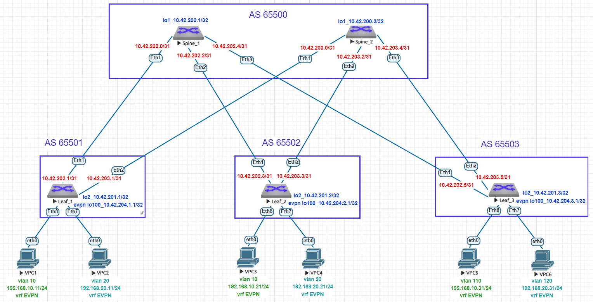

# Домашнее задание №6
## Overlay. VxLAN EVPN L3
### Цель:
- Настроить маршрутизацию в рамках Overlay между клиентами
- Проверить связанность между устройствами
### Выполнение:
#### Собранная схема сети


#### Конфигурация оборудования

- [Leaf-1](config/Leaf-1.conf)

```

```

- [Leaf-2](config/Leaf-2.conf)

```

```

- [Leaf-3](config/Leaf-3.conf)

```

```


---
#### Проверка связности 

- Leaf-1

```

```

- Leaf-2

```

```

- Leaf-3

```


```

- VPC1
 ```

 ```

- VPC2
```

```

- VPC5
```

```

- VPC6
```

```
