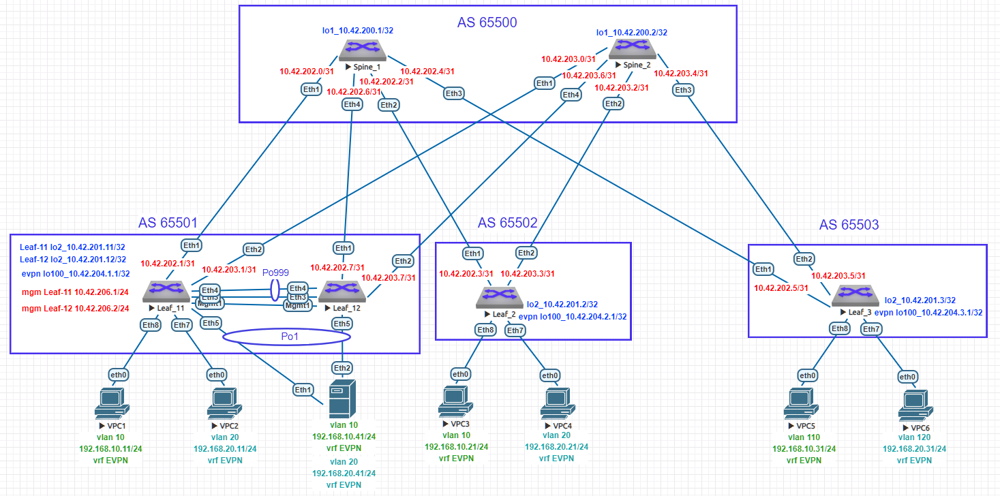

# Домашнее задание №7
## VXLAN. Multihoming
### Цель:
- Подключить клиента 2-я линками к различным Leaf с использование агрегированного канала с LACP
- Настроить multihoming для работы в Overlay сети с использованием MLAG с поддержкой VXLAN
- Протестировать отказоустойчивость - убедиться, что связнность не теряется при отключении одного из линков
### Выполнение:
#### Собранная схема сети


#### Конфигурация оборудования

- [Leaf-11](config/Leaf-11.conf)

```
vlan 4090
   name mlag-peer
   trunk group mlag-peer
!
vlan 4091
   name mlag-ibgp
   trunk group mlag-peer
!
vrf instance EVPN
!
vrf instance mgmt
!
interface Port-Channel1
   switchport mode trunk
   mlag 1
!
interface Port-Channel999
   description MLAG Peer
   switchport mode trunk
   switchport trunk group mlag-peer
   spanning-tree link-type point-to-point
!
interface Ethernet1
   no switchport
   ip address 10.42.202.1/31
!
interface Ethernet2
   no switchport
   ip address 10.42.203.1/31
!
interface Ethernet3
   description mlag peer link
   channel-group 999 mode active
!
interface Ethernet4
   description mlag peer link
   channel-group 999 mode active
!
interface Ethernet5
   switchport access vlan 10
   channel-group 1 mode active
!
interface Loopback2
   ip address 10.42.201.11/32
!
interface Loopback100
   ip address 10.42.204.1/32
!
interface Management1
   vrf mgmt
   ip address 10.42.206.1/24
!
interface Vlan10
   vrf EVPN
   ip address 192.168.10.2/24
   ip virtual-router address 192.168.10.1
!
interface Vlan20
   vrf EVPN
   ip address 192.168.20.2/24
   ip virtual-router address 192.168.20.1
!
interface Vlan4090
   no autostate
   ip address 10.42.205.0/31
!
interface Vlan4091
   mtu 9214
   ip address 10.42.207.0/31
!
interface Vxlan1
   vxlan source-interface Loopback100
   vxlan udp-port 4789
   vxlan vlan 10 vni 100010
   vxlan vlan 20 vni 100020
   vxlan vrf EVPN vni 9999
   vxlan learn-restrict any
!
ip virtual-router mac-address 00:aa:aa:aa:aa:aa
!
ip routing
ip routing vrf EVPN
no ip routing vrf mgmt
!
mlag configuration
   domain-id leafs
   local-interface Vlan4090
   peer-address 10.42.205.1
   peer-address heartbeat 10.42.206.2 vrf mgmt
   peer-link Port-Channel999
   dual-primary detection delay 10 action errdisable all-interfaces
!
router bgp 65501
   router-id 10.42.201.11
   timers bgp 3 9
   distance bgp 20 200 200
   maximum-paths 12
   neighbor evpn peer group
   neighbor evpn remote-as 65500
   neighbor evpn update-source Loopback2
   neighbor evpn ebgp-multihop 3
   neighbor evpn send-community extended
   neighbor evpn maximum-routes 12000 warning-only
   neighbor spines peer group
   neighbor spines remote-as 65500
   neighbor spines maximum-routes 12000 warning-only
   neighbor underlay_ibgp peer group
   neighbor underlay_ibgp remote-as 65501
   neighbor underlay_ibgp next-hop-self
   neighbor underlay_ibgp maximum-routes 12000 warning-only
   neighbor 10.42.200.1 peer group evpn
   neighbor 10.42.200.2 peer group evpn
   neighbor 10.42.202.0 peer group spines
   neighbor 10.42.202.0 bfd
   neighbor 10.42.202.0 password 7 ibb0kmOVqswUe/kiMbQcQg==
   neighbor 10.42.203.0 peer group spines
   neighbor 10.42.203.0 bfd
   neighbor 10.42.203.0 password 7 ibb0kmOVqswUe/kiMbQcQg==
   neighbor 10.42.207.1 peer group underlay_ibgp
   !
   vlan 10
      rd 65501:100010
      route-target both 10:100010
      redistribute learned
   !
   vlan 20
      rd 65501:100020
      route-target both 20:100020
      redistribute learned
   !
   address-family evpn
      neighbor evpn activate
   !
   address-family ipv4
      no neighbor evpn activate
      neighbor spines activate
      neighbor underlay_ibgp activate
      network 10.42.201.1/32
      network 10.42.201.11/32
      network 10.42.204.1/32
   !
   vrf EVPN
      rd 65501:9999
      route-target import evpn 9999:9999
      route-target export evpn 9999:9999
      redistribute connected
```

- [Leaf-12](config/Leaf-12.conf)

```
vlan 4090
   name mlag-peer
   trunk group mlag-peer
!
vlan 4091
   name mlag-ibgp
   trunk group mlag-peer
!
vrf instance EVPN
!
vrf instance mgmt
!
interface Port-Channel1
   switchport mode trunk
   mlag 1
!
interface Port-Channel999
   description MLAG Peer
   switchport mode trunk
   switchport trunk group mlag-peer
   spanning-tree link-type point-to-point
!
interface Ethernet1
   no switchport
   ip address 10.42.202.7/31
!
interface Ethernet2
   no switchport
   ip address 10.42.203.7/31
!
interface Ethernet3
   description mlag peer link
   channel-group 999 mode active
!
interface Ethernet4
   description mlag peer link
   channel-group 999 mode active
!
interface Ethernet5
   switchport access vlan 10
   channel-group 1 mode active
!
interface Loopback2
   ip address 10.42.201.12/32
!
interface Loopback100
   ip address 10.42.204.1/32
!
interface Management1
   vrf mgmt
   ip address 10.42.206.2/24
!
interface Vlan10
   vrf EVPN
   ip address 192.168.10.3/24
   ip virtual-router address 192.168.10.1
!
interface Vlan20
   vrf EVPN
   ip address 192.168.20.3/24
   ip virtual-router address 192.168.20.1
!
interface Vlan4090
   no autostate
   ip address 10.42.205.1/31
!
interface Vlan4091
   mtu 9214
   ip address 10.42.207.1/31
!
interface Vxlan1
   vxlan source-interface Loopback100
   vxlan udp-port 4789
   vxlan vlan 10 vni 100010
   vxlan vlan 20 vni 100020
   vxlan vrf EVPN vni 9999
   vxlan learn-restrict any
!
ip virtual-router mac-address 00:aa:aa:aa:aa:aa
!
ip routing
ip routing vrf EVPN
no ip routing vrf mgmt
!
mlag configuration
   domain-id leafs
   local-interface Vlan4090
   peer-address 10.42.205.0
   peer-address heartbeat 10.42.206.1 vrf mgmt
   peer-link Port-Channel999
   dual-primary detection delay 10 action errdisable all-interfaces
!
router bgp 65501
   router-id 10.42.201.12
   timers bgp 3 9
   distance bgp 20 200 200
   maximum-paths 12
   neighbor evpn peer group
   neighbor evpn remote-as 65500
   neighbor evpn update-source Loopback2
   neighbor evpn ebgp-multihop 3
   neighbor evpn send-community extended
   neighbor evpn maximum-routes 12000 warning-only
   neighbor spines peer group
   neighbor spines remote-as 65500
   neighbor spines maximum-routes 12000 warning-only
   neighbor underlay_ibgp peer group
   neighbor underlay_ibgp remote-as 65501
   neighbor underlay_ibgp next-hop-self
   neighbor underlay_ibgp maximum-routes 12000 warning-only
   neighbor 10.42.200.1 peer group evpn
   neighbor 10.42.200.2 peer group evpn
   neighbor 10.42.202.6 peer group spines
   neighbor 10.42.202.6 bfd
   neighbor 10.42.202.6 password 7 qQomqGQnIabJvDCIzGdqnQ==
   neighbor 10.42.203.6 peer group spines
   neighbor 10.42.203.6 bfd
   neighbor 10.42.203.6 password 7 qQomqGQnIabJvDCIzGdqnQ==
   neighbor 10.42.207.0 peer group underlay_ibgp
   !
   vlan 10
      rd 65501:100010
      route-target both 10:100010
      redistribute learned
   !
   vlan 20
      rd 65501:100020
      route-target both 20:100020
      redistribute learned
   !
   address-family evpn
      neighbor evpn activate
   !
   address-family ipv4
      no neighbor evpn activate
      neighbor spines activate
      neighbor underlay_ibgp activate
      network 10.42.201.12/32
      network 10.42.204.1/32
   !
   vrf EVPN
      rd 65501:9999
      route-target import evpn 9999:9999
      route-target export evpn 9999:9999
      redistribute connected
```

- [Server1](config/Server1.conf)

```
vlan 10,20
!
interface Port-Channel1
   switchport mode trunk
!
interface Ethernet1
   channel-group 1 mode active
!
interface Ethernet2
   channel-group 1 mode active
!
interface Vlan10
   ip address 192.168.10.41/24
!
interface Vlan20
   ip address 192.168.20.41/24
!
ip routing
```


---
#### Проверка связности 

- Leaf-11

```
Leaf-11#sh mlag
MLAG Configuration:
domain-id                          :               leafs
local-interface                    :            Vlan4090
peer-address                       :         10.42.205.1
peer-link                          :     Port-Channel999
hb-peer-address                    :         10.42.206.2
hb-peer-vrf                        :                mgmt
peer-config                        :          consistent

MLAG Status:
state                              :              Active
negotiation status                 :           Connected
peer-link status                   :                  Up
local-int status                   :                  Up
system-id                          :   52:00:00:45:ab:df
dual-primary detection             :          Configured
dual-primary interface errdisabled :               False

MLAG Ports:
Disabled                           :                   0
Configured                         :                   0
Inactive                           :                   0
Active-partial                     :                   0
Active-full                        :                   1

Leaf-11#sh mlag interfaces detail
                                        local/remote
 mlag         state   local   remote    oper    config    last change   changes
------ ------------- ------- -------- ------- ---------- -------------- -------
    1   active-full     Po1      Po1   up/up   ena/ena    1:57:43 ago         3

Leaf-11#sh port-channel 1 detailed
Port Channel Port-Channel1 (Fallback State: Unconfigured):
Minimum links: unconfigured
Minimum speed: unconfigured
Current weight/Max weight: 1/16
  Active Ports:
      Port               Time Became Active      Protocol      Mode      Weight
    ------------------ ----------------------- ------------- ----------- ------
      Ethernet5          8:12:42                 LACP          Active      1
      PeerEthernet5      Thu 22:52:07            LACP          Active      0

Leaf-11#sh bgp evpn
BGP routing table information for VRF default
Router identifier 10.42.201.11, local AS number 65501
Route status codes: * - valid, > - active, S - Stale, E - ECMP head, e - ECMP
                    c - Contributing to ECMP, % - Pending BGP convergence
Origin codes: i - IGP, e - EGP, ? - incomplete
AS Path Attributes: Or-ID - Originator ID, C-LST - Cluster List, LL Nexthop - Link Local Nexthop

          Network                Next Hop              Metric  LocPref Weight  Path
 * >      RD: 65501:100010 imet 10.42.204.1
                                 -                     -       -       0       i
 * >      RD: 65501:100020 imet 10.42.204.1
                                 -                     -       -       0       i
 * >Ec    RD: 65502:100010 imet 10.42.204.2
                                 10.42.204.2           -       100     0       65500 65502 i
 *  ec    RD: 65502:100010 imet 10.42.204.2
                                 10.42.204.2           -       100     0       65500 65502 i
 * >Ec    RD: 65502:100020 imet 10.42.204.2
                                 10.42.204.2           -       100     0       65500 65502 i
 *  ec    RD: 65502:100020 imet 10.42.204.2
                                 10.42.204.2           -       100     0       65500 65502 i
 * >Ec    RD: 65503:100010 imet 10.42.204.3
                                 10.42.204.3           -       100     0       65500 65503 i
 *  ec    RD: 65503:100010 imet 10.42.204.3
                                 10.42.204.3           -       100     0       65500 65503 i
 * >Ec    RD: 65503:100020 imet 10.42.204.3
                                 10.42.204.3           -       100     0       65500 65503 i
 *  ec    RD: 65503:100020 imet 10.42.204.3
                                 10.42.204.3           -       100     0       65500 65503 i
 * >      RD: 65501:9999 ip-prefix 192.168.10.0/24
                                 -                     -       -       0       i
 * >Ec    RD: 65502:9999 ip-prefix 192.168.10.0/24
                                 10.42.204.2           -       100     0       65500 65502 i
 *  ec    RD: 65502:9999 ip-prefix 192.168.10.0/24
                                 10.42.204.2           -       100     0       65500 65502 i
 * >Ec    RD: 65503:9999 ip-prefix 192.168.10.0/24
                                 10.42.204.3           -       100     0       65500 65503 i
 *  ec    RD: 65503:9999 ip-prefix 192.168.10.0/24
                                 10.42.204.3           -       100     0       65500 65503 i
 * >      RD: 65501:9999 ip-prefix 192.168.20.0/24
                                 -                     -       -       0       i
 * >Ec    RD: 65502:9999 ip-prefix 192.168.20.0/24
                                 10.42.204.2           -       100     0       65500 65502 i
 *  ec    RD: 65502:9999 ip-prefix 192.168.20.0/24
                                 10.42.204.2           -       100     0       65500 65502 i
 * >Ec    RD: 65503:9999 ip-prefix 192.168.20.0/24
                                 10.42.204.3           -       100     0       65500 65503 i
 *  ec    RD: 65503:9999 ip-prefix 192.168.20.0/24
                                 10.42.204.3           -       100     0       65500 65503 i

Leaf-11#sh ip route

VRF: default

 B E      10.42.200.1/32 [20/0] via 10.42.202.0, Ethernet1
 B E      10.42.200.2/32 [20/0] via 10.42.203.0, Ethernet2
 B E      10.42.201.2/32 [20/0] via 10.42.202.0, Ethernet1
                                via 10.42.203.0, Ethernet2
 B E      10.42.201.3/32 [20/0] via 10.42.202.0, Ethernet1
                                via 10.42.203.0, Ethernet2
 C        10.42.201.11/32 is directly connected, Loopback2
 B I      10.42.201.12/32 [200/0] via 10.42.207.1, Vlan4091
 C        10.42.202.0/31 is directly connected, Ethernet1
 C        10.42.203.0/31 is directly connected, Ethernet2
 C        10.42.204.1/32 is directly connected, Loopback100
 B E      10.42.204.2/32 [20/0] via 10.42.202.0, Ethernet1
                                via 10.42.203.0, Ethernet2
 B E      10.42.204.3/32 [20/0] via 10.42.202.0, Ethernet1
                                via 10.42.203.0, Ethernet2
 C        10.42.205.0/31 is directly connected, Vlan4090
 C        10.42.207.0/31 is directly connected, Vlan4091

Leaf-11#sh ip route vrf EVPN

VRF: EVPN

 B E      192.168.10.31/32 [20/0] via VTEP 10.42.204.3 VNI 9999 router-mac 50:00:00:d5:5d:c0 local-interface Vxlan1
 C        192.168.10.0/24 is directly connected, Vlan10
 B E      192.168.20.31/32 [20/0] via VTEP 10.42.204.3 VNI 9999 router-mac 50:00:00:d5:5d:c0 local-interface Vxlan1
 C        192.168.20.0/24 is directly connected, Vlan20


Leaf-11#sh vxlan vni
VNI to VLAN Mapping for Vxlan1
VNI          VLAN       Source       Interface           802.1Q Tag
------------ ---------- ------------ ------------------- ----------
100010       10         static       Ethernet5           untagged
                                     Ethernet8           untagged
                                     Port-Channel1       10
                                     Vxlan1              10
100020       20         static       Ethernet7           untagged
                                     Port-Channel1       20
                                     Vxlan1              20

VNI to dynamic VLAN Mapping for Vxlan1
VNI        VLAN       VRF        Source
---------- ---------- ---------- ------------
9999       4094       EVPN       evpn
```

- Leaf-12

```
Leaf-12#sh mlag
MLAG Configuration:
domain-id                          :               leafs
local-interface                    :            Vlan4090
peer-address                       :         10.42.205.0
peer-link                          :     Port-Channel999
hb-peer-address                    :         10.42.206.1
hb-peer-vrf                        :                mgmt
peer-config                        :          consistent

MLAG Status:
state                              :              Active
negotiation status                 :           Connected
peer-link status                   :                  Up
local-int status                   :                  Up
system-id                          :   52:00:00:45:ab:df
dual-primary detection             :          Configured
dual-primary interface errdisabled :               False

MLAG Ports:
Disabled                           :                   0
Configured                         :                   0
Inactive                           :                   0
Active-partial                     :                   0
Active-full                        :                   1


Leaf-12#sh mlag interfaces detail
                                        local/remote
 mlag         state   local   remote    oper    config    last change   changes
------ ------------- ------- -------- ------- ---------- -------------- -------
    1   active-full     Po1      Po1   up/up   ena/ena    2:09:53 ago        17


Leaf-12#sh port-channel 1 detailed
Port Channel Port-Channel1 (Fallback State: Unconfigured):
Minimum links: unconfigured
Minimum speed: unconfigured
Current weight/Max weight: 1/16
  Active Ports:
      Port               Time Became Active      Protocol      Mode      Weight
    ------------------ ----------------------- ------------- ----------- ------
      Ethernet5          Thu 22:52:07            LACP          Active      1
      PeerEthernet5      Sun 8:12:42             LACP          Active      0


Leaf-12#sh bgp evpn
BGP routing table information for VRF default
Router identifier 10.42.201.12, local AS number 65501
Route status codes: * - valid, > - active, S - Stale, E - ECMP head, e - ECMP
                    c - Contributing to ECMP, % - Pending BGP convergence
Origin codes: i - IGP, e - EGP, ? - incomplete
AS Path Attributes: Or-ID - Originator ID, C-LST - Cluster List, LL Nexthop - Link Local Nexthop

          Network                Next Hop              Metric  LocPref Weight  Path
 * >      RD: 65501:100010 imet 10.42.204.1
                                 -                     -       -       0       i
 * >      RD: 65501:100020 imet 10.42.204.1
                                 -                     -       -       0       i
 * >Ec    RD: 65502:100010 imet 10.42.204.2
                                 10.42.204.2           -       100     0       65500 65502 i
 *  ec    RD: 65502:100010 imet 10.42.204.2
                                 10.42.204.2           -       100     0       65500 65502 i
 * >Ec    RD: 65502:100020 imet 10.42.204.2
                                 10.42.204.2           -       100     0       65500 65502 i
 *  ec    RD: 65502:100020 imet 10.42.204.2
                                 10.42.204.2           -       100     0       65500 65502 i
 * >Ec    RD: 65503:100010 imet 10.42.204.3
                                 10.42.204.3           -       100     0       65500 65503 i
 *  ec    RD: 65503:100010 imet 10.42.204.3
                                 10.42.204.3           -       100     0       65500 65503 i
 * >Ec    RD: 65503:100020 imet 10.42.204.3
                                 10.42.204.3           -       100     0       65500 65503 i
 *  ec    RD: 65503:100020 imet 10.42.204.3
                                 10.42.204.3           -       100     0       65500 65503 i
 * >      RD: 65501:9999 ip-prefix 192.168.10.0/24
                                 -                     -       -       0       i
 * >Ec    RD: 65502:9999 ip-prefix 192.168.10.0/24
                                 10.42.204.2           -       100     0       65500 65502 i
 *  ec    RD: 65502:9999 ip-prefix 192.168.10.0/24
                                 10.42.204.2           -       100     0       65500 65502 i
 * >Ec    RD: 65503:9999 ip-prefix 192.168.10.0/24
                                 10.42.204.3           -       100     0       65500 65503 i
 *  ec    RD: 65503:9999 ip-prefix 192.168.10.0/24
                                 10.42.204.3           -       100     0       65500 65503 i
 * >      RD: 65501:9999 ip-prefix 192.168.20.0/24
                                 -                     -       -       0       i
 * >Ec    RD: 65502:9999 ip-prefix 192.168.20.0/24
                                 10.42.204.2           -       100     0       65500 65502 i
 *  ec    RD: 65502:9999 ip-prefix 192.168.20.0/24
                                 10.42.204.2           -       100     0       65500 65502 i
 * >Ec    RD: 65503:9999 ip-prefix 192.168.20.0/24
                                 10.42.204.3           -       100     0       65500 65503 i
 *  ec    RD: 65503:9999 ip-prefix 192.168.20.0/24
                                 10.42.204.3           -       100     0       65500 65503 i


Leaf-12#sh ip route

VRF: default

 B E      10.42.200.1/32 [20/0] via 10.42.202.6, Ethernet1
 B E      10.42.200.2/32 [20/0] via 10.42.203.6, Ethernet2
 B E      10.42.201.2/32 [20/0] via 10.42.202.6, Ethernet1
                                via 10.42.203.6, Ethernet2
 B E      10.42.201.3/32 [20/0] via 10.42.202.6, Ethernet1
                                via 10.42.203.6, Ethernet2
 B I      10.42.201.11/32 [200/0] via 10.42.207.0, Vlan4091
 C        10.42.201.12/32 is directly connected, Loopback2
 C        10.42.202.6/31 is directly connected, Ethernet1
 C        10.42.203.6/31 is directly connected, Ethernet2
 C        10.42.204.1/32 is directly connected, Loopback100
 B E      10.42.204.2/32 [20/0] via 10.42.202.6, Ethernet1
                                via 10.42.203.6, Ethernet2
 B E      10.42.204.3/32 [20/0] via 10.42.202.6, Ethernet1
                                via 10.42.203.6, Ethernet2
 C        10.42.205.0/31 is directly connected, Vlan4090
 C        10.42.207.0/31 is directly connected, Vlan4091


Leaf-12#sh ip route vrf EVPN

VRF: EVPN

 B E      192.168.10.31/32 [20/0] via VTEP 10.42.204.3 VNI 9999 router-mac 50:00:00:d5:5d:c0 local-interface Vxlan1
 C        192.168.10.0/24 is directly connected, Vlan10
 B E      192.168.20.31/32 [20/0] via VTEP 10.42.204.3 VNI 9999 router-mac 50:00:00:d5:5d:c0 local-interface Vxlan1
 C        192.168.20.0/24 is directly connected, Vlan20

Leaf-12#sh vxlan vni
VNI to VLAN Mapping for Vxlan1
VNI          VLAN       Source       Interface           802.1Q Tag
------------ ---------- ------------ ------------------- ----------
100010       10         static       Ethernet5           untagged
                                     PeerEthernet8       untagged
                                     Port-Channel1       10
                                     Vxlan1              10
100020       20         static       PeerEthernet7       untagged
                                     Port-Channel1       20
                                     Vxlan1              20

VNI to dynamic VLAN Mapping for Vxlan1
VNI        VLAN       VRF        Source
---------- ---------- ---------- ------------
9999       4094       EVPN       evpn
```

- Server1

```
Server1#sh port-channel 1 detailed
Port Channel Port-Channel1 (Fallback State: Unconfigured):
Minimum links: unconfigured
Minimum speed: unconfigured
Current weight/Max weight: 2/16
  Active Ports:
       Port            Time Became Active       Protocol       Mode      Weight
    --------------- ------------------------ -------------- ------------ ------
       Ethernet1       Thu 23:27:46             LACP           Active      1
       Ethernet2       Thu 22:52:08             LACP           Active      1

```

- VPC5
```
VPC5> ping 192.168.10.41

192.168.10.41 icmp_seq=1 timeout
84 bytes from 192.168.10.41 icmp_seq=2 ttl=64 time=21.647 ms
84 bytes from 192.168.10.41 icmp_seq=3 ttl=64 time=22.856 ms
84 bytes from 192.168.10.41 icmp_seq=4 ttl=64 time=19.928 ms
84 bytes from 192.168.10.41 icmp_seq=5 ttl=64 time=21.570 ms

VPC5> ping 192.168.20.41

84 bytes from 192.168.20.41 icmp_seq=1 ttl=64 time=331.817 ms
84 bytes from 192.168.20.41 icmp_seq=2 ttl=64 time=62.051 ms
84 bytes from 192.168.20.41 icmp_seq=3 ttl=64 time=42.094 ms
84 bytes from 192.168.20.41 icmp_seq=4 ttl=64 time=31.319 ms
84 bytes from 192.168.20.41 icmp_seq=5 ttl=64 time=75.497 ms
```

- VPC6
```
VPC6> ping 192.168.10.41

84 bytes from 192.168.10.41 icmp_seq=1 ttl=64 time=126.022 ms
84 bytes from 192.168.10.41 icmp_seq=2 ttl=64 time=95.138 ms
84 bytes from 192.168.10.41 icmp_seq=3 ttl=64 time=27.137 ms
84 bytes from 192.168.10.41 icmp_seq=4 ttl=64 time=23.694 ms
84 bytes from 192.168.10.41 icmp_seq=5 ttl=64 time=44.373 ms

VPC6> ping 192.168.20.41

84 bytes from 192.168.20.41 icmp_seq=1 ttl=64 time=147.448 ms
84 bytes from 192.168.20.41 icmp_seq=2 ttl=64 time=71.050 ms
84 bytes from 192.168.20.41 icmp_seq=3 ttl=64 time=49.055 ms
84 bytes from 192.168.20.41 icmp_seq=4 ttl=64 time=28.704 ms
84 bytes from 192.168.20.41 icmp_seq=5 ttl=64 time=33.087 ms
```

#### Проверка связности при отключении одного линка к серверу

- Leaf-11

```
Leaf-11#conf t
Leaf-11(config)#int eth5
Leaf-11(config-if-Et5)#shut

Leaf-11#sh port-ch 1 detailed
Port Channel Port-Channel1 (Fallback State: Unconfigured):
Minimum links: unconfigured
Minimum speed: unconfigured
Current weight/Max weight: 0/16
  Active Ports:
      Port               Time Became Active      Protocol      Mode      Weight
    ------------------ ----------------------- ------------- ----------- ------
      PeerEthernet5      Thu 22:52:07            LACP          Active      0

  Configured, but inactive ports:
       Port            Time Became Inactive    Reason
    --------------- -------------------------- -----------------------------
       Ethernet5       10:42:51                link down in LACP negotiation

Leaf-11#sh mac address-table | in  5000.002f.d8fe
  10    5000.002f.d8fe    DYNAMIC     Po999      1       0:00:33 ago
  20    5000.002f.d8fe    DYNAMIC     Po999      1       0:05:39 ago
```

- Leaf-12

```
Leaf-12#sh port-channel 1 detailed
Port Channel Port-Channel1 (Fallback State: Unconfigured):
Minimum links: unconfigured
Minimum speed: unconfigured
Current weight/Max weight: 1/16
  Active Ports:
       Port            Time Became Active       Protocol       Mode      Weight
    --------------- ------------------------ -------------- ------------ ------
       Ethernet5       Thu 22:52:07             LACP           Active      1

  Configured, but inactive ports:
      Port                Time Became Inactive    Reason
    ------------------ -------------------------- -----------------------------
      PeerEthernet5       Sun 10:42:51            link down in LACP negotiation

Leaf-12#sh mac address-table| in  5000.002f.d8fe
  10    5000.002f.d8fe    DYNAMIC     Po1        1       0:00:05 ago
  20    5000.002f.d8fe    DYNAMIC     Po1        1       0:05:10 ago
```

- Server1

```
Server1#sh port-channel 1 detailed
Port Channel Port-Channel1 (Fallback State: Unconfigured):
Minimum links: unconfigured
Minimum speed: unconfigured
Current weight/Max weight: 1/16
  Active Ports:
       Port            Time Became Active       Protocol       Mode      Weight
    --------------- ------------------------ -------------- ------------ ------
       Ethernet2       Thu 22:52:08             LACP           Active      1

  Configured, but inactive ports:
       Port            Time Became Inactive    Reason
    --------------- -------------------------- -----------------------------
       Ethernet1       1:57:55                 link down in LACP negotiation

Server1#sh interfaces vlan10
Vlan10 is up, line protocol is up (connected)
  Hardware is Vlan, address is 5000.002f.d8fe (bia 5000.002f.d8fe)
  Internet address is 192.168.10.41/24

Server1#sh interfaces vlan20
Vlan20 is up, line protocol is up (connected)
  Hardware is Vlan, address is 5000.002f.d8fe (bia 5000.002f.d8fe)
  Internet address is 192.168.20.41/24
```

- VPC5
```
VPC5> ping 192.168.10.41 -c 2

84 bytes from 192.168.10.41 icmp_seq=1 ttl=64 time=386.062 ms
84 bytes from 192.168.10.41 icmp_seq=2 ttl=64 time=33.291 ms

VPC5> ping 192.168.20.41 -c 2

84 bytes from 192.168.20.41 icmp_seq=1 ttl=64 time=93.594 ms
84 bytes from 192.168.20.41 icmp_seq=2 ttl=64 time=44.366 ms
```

- VPC6
```
VPC6> ping 192.168.10.41 -c 2

84 bytes from 192.168.10.41 icmp_seq=1 ttl=64 time=55.583 ms
84 bytes from 192.168.10.41 icmp_seq=2 ttl=64 time=29.942 ms

VPC6> ping 192.168.10.41 -c 2

84 bytes from 192.168.10.41 icmp_seq=1 ttl=64 time=280.710 ms
84 bytes from 192.168.10.41 icmp_seq=2 ttl=64 time=38.056 ms
```

#### Проверка связности отключении одного линка к серверу и одного Leaf от всех Spine

- Leaf-11

```
Leaf-11#sh ip route

VRF: default
 B E      10.42.200.1/32 [20/0] via 10.42.202.0, Ethernet1
 B E      10.42.200.2/32 [20/0] via 10.42.203.0, Ethernet2
 B E      10.42.201.2/32 [20/0] via 10.42.202.0, Ethernet1
                                via 10.42.203.0, Ethernet2
 B E      10.42.201.3/32 [20/0] via 10.42.202.0, Ethernet1
                                via 10.42.203.0, Ethernet2
 C        10.42.201.11/32 is directly connected, Loopback2
 B I      10.42.201.12/32 [200/0] via 10.42.207.1, Vlan4091
 C        10.42.202.0/31 is directly connected, Ethernet1
 C        10.42.203.0/31 is directly connected, Ethernet2
 C        10.42.204.1/32 is directly connected, Loopback100
 B E      10.42.204.2/32 [20/0] via 10.42.202.0, Ethernet1
                                via 10.42.203.0, Ethernet2
 B E      10.42.204.3/32 [20/0] via 10.42.202.0, Ethernet1
                                via 10.42.203.0, Ethernet2
 C        10.42.205.0/31 is directly connected, Vlan4090
 C        10.42.207.0/31 is directly connected, Vlan4091


Leaf-11#sh ip route vrf EVPN

VRF: EVPN
 B E      192.168.10.31/32 [20/0] via VTEP 10.42.204.3 VNI 9999 router-mac 50:00:00:d5:5d:c0 local-interface Vxlan1
 C        192.168.10.0/24 is directly connected, Vlan10
 B E      192.168.20.31/32 [20/0] via VTEP 10.42.204.3 VNI 9999 router-mac 50:00:00:d5:5d:c0 local-interface Vxlan1
 C        192.168.20.0/24 is directly connected, Vlan20

```

- Leaf-12

```
Leaf-12#conf t
Leaf-12(config)#interface eth1-2
Leaf-12(config-if-Et1-2)#shut

Leaf-12#sh ip route

VRF: default
 B I      10.42.200.1/32 [200/0] via 10.42.207.0, Vlan4091
 B I      10.42.200.2/32 [200/0] via 10.42.207.0, Vlan4091
 B I      10.42.201.2/32 [200/0] via 10.42.207.0, Vlan4091
 B I      10.42.201.3/32 [200/0] via 10.42.207.0, Vlan4091
 B I      10.42.201.11/32 [200/0] via 10.42.207.0, Vlan4091
 C        10.42.201.12/32 is directly connected, Loopback2
 C        10.42.204.1/32 is directly connected, Loopback100
 B I      10.42.204.2/32 [200/0] via 10.42.207.0, Vlan4091
 B I      10.42.204.3/32 [200/0] via 10.42.207.0, Vlan4091
 C        10.42.205.0/31 is directly connected, Vlan4090
 C        10.42.207.0/31 is directly connected, Vlan4091

Leaf-12#
Leaf-12#sh ip route vrf EVPN

VRF: EVPN
 B E      192.168.10.31/32 [20/0] via VTEP 10.42.204.3 VNI 9999 router-mac 50:00:00:d5:5d:c0 local-interface Vxlan1
 C        192.168.10.0/24 is directly connected, Vlan10
 B E      192.168.20.31/32 [20/0] via VTEP 10.42.204.3 VNI 9999 router-mac 50:00:00:d5:5d:c0 local-interface Vxlan1
 C        192.168.20.0/24 is directly connected, Vlan20
```

- VPC5
```
VPC5> ping 192.168.10.41 -c 2

84 bytes from 192.168.10.41 icmp_seq=1 ttl=64 time=366.017 ms
84 bytes from 192.168.10.41 icmp_seq=2 ttl=64 time=32.368 ms

VPC5> ping 192.168.20.41 -c 2

84 bytes from 192.168.20.41 icmp_seq=1 ttl=64 time=50.585 ms
84 bytes from 192.168.20.41 icmp_seq=2 ttl=64 time=78.115 ms
```

- VPC6
```
VPC6> ping 192.168.10.41 -c 2

84 bytes from 192.168.10.41 icmp_seq=1 ttl=64 time=84.516 ms
84 bytes from 192.168.10.41 icmp_seq=2 ttl=64 time=42.572 ms

VPC6> ping 192.168.20.41 -c 2

84 bytes from 192.168.20.41 icmp_seq=1 ttl=64 time=45.714 ms
84 bytes from 192.168.20.41 icmp_seq=2 ttl=64 time=46.311 ms
```
